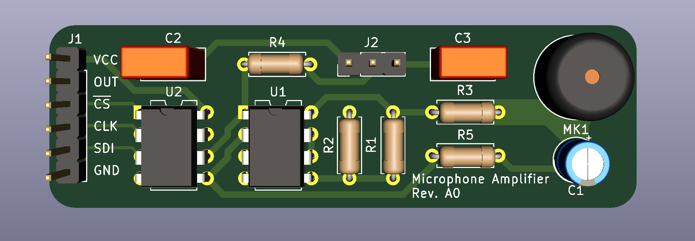
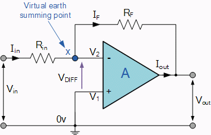

# Microphone Amplifier


## Introduction
This project features a variable gain amplifier used to control the gain of a simple electret condenser, also known as a microphone. While this board may look very basic, the application uses of this can be *very* involved. 

## Op-Amp
Op-Amps, or Operational Amplifiers, are used everywhere. At its core, it takes an input and scales it by some factor at the output. Yet it's not that easy. There are a lot different configurations one can do with a basic Op-Amp and one must think of the desired use to figure out the configuration to be used. 

### Inverting Amplifier and Changing the Gain
The most basic Op-Amp use is the inverting amplifier ([Inverting Operational Amplifier](https://www.electronics-tutorials.ws/opamp/opamp_2.html)) as shown below.



It is configurable so that the input can be scaled by a simple equation:

    Av = -Rf / Rin

One can control the gain, `Av`, by simply choosing resistors values for both `Rin` and `Rf`. The exact workings behind the Op-Amp are fundamental to closed-loop systems, which I won't cover in this project. Just know that the feedback resistor, `Rf`, is necessary to control the closed-loop gain.

If one wants the change the gain of the Op-Amp, one must swap out the value of the feedback resistor. And this is the problem. **The intended use of this microphone amplifier is to amplify the input signal coming from the electret microphone, and the exact input signal varies wildly from microVolts to milliVolts.** The input signal from the microphone varies with the loudness of speech, music, e.t.c. In the presence of a quiet sound, the input signal will be very small, yet in the presence of a loud sound, the input signal will be very large.

In order to receive an output signal that is properly amplified throughout the entirety of its operation, one would have to change the resistor value constantly in order to maintain proper amplification. For this problem, there exists a component called the potentiometer. A potentiometer has a small knob and one can vary the resistance between a certain value by twisting the knob. Inside of the potentiometer is a small "wiper", which acts as a little needle that interrupts the total resistance proportional to the position relative to one side or another. The actual resistance on one side of the potentiometer is a function of the position of the knob.  Potentiometers exist in many different values, such as 1kOhm, 5kOhm, 50kOhm and 100kOhm. These exist for many different purposes, but for this case a 100kOhm potentiometer was used to provide the following range of gains:
```
Rin = 470
Av_0 = -0 / 470 = 0
Av_100k = -100e3 / 470 = 212.8
```
Theoretically, one could twist the potentiometer to adjust the gain of the amplifier to select the proper amplification. This would quickly become very cumbersome, therefore a solution is needed.

## Digital Potentiometer
There is a component called a digital potentiometer which is essentially a potentiometer that is configurable via digital communication. In our problem, we need to vary the feedback resistance very quickly, nearly instantaneously based on the received output signal.

The digital potentiometer used in this amplifier is an [MCP4151](http://ww1.microchip.com/downloads/en/devicedoc/22060b.pdf), which has 257 steps with the full range of 100kOhms. This means, each step is equal to 389.1Ohms.

    Av_n = -389.1 / 470 * n = -0.828 * n

This level of granularity enables us to control the gain with a fine amount of control. In order to communicate with the MCP4151, we must refer to the datasheet. Skipping all of the basics of SPI communication, we may refer to the datasheet SPI command example.

As seen above, the command contains three components, the memory address, the command and the data. All of this is compacted into a 16-bit command. While it would be nice to read data from the MCP4151, in this project we are only concerned with the write function and we will assume that the MCP4151 will function properly and the wiper is set correctly.

The following is the register contents of the MCP4151, which shows the internal registers and data format expected via SPI communication.

For example, if we wanted to set the resistance to 50kOhms, we would first have to find the step at which this value occurs.

    Ra = (389.1 * n) # We want this value
    Rb = (389.1 * (257 - n))
    50e3 = (389.1 * n) = 50e3 / 389.1 = n
    n = 128.5 ~= 128

Now that we've found the wiper value that we want to send to the MCP4151, we need to compile the full instruction.

    CMD = 0h 	//Write Value
    ADDR = 00h	//Wiper 0
    DATA = 128 = 81h
    
    //Combine the data
    uint8_t data[2];
    data[0] = ADDR << 4;	//Shift the address to align it properly
    data[0] |= CMD << 2;	//Shift the command to align it properly
    data[1] = DATA;
If everything is setup properly, the wiper should attain the value of 128 and the resistance on each side of the wiper should be approximately 50kOhms. Since this project is only considerate of one side of the digital potentiometer, the other side, Rb, is ignored and left unconnected.

## Algorithm
Since we are going to control the digital potentiometer rapidly, we must develop an algorithm to control the level of gain we need. When stepping into algorithms, the options we have can be limitless. While it would be ideal to have a complex algorithm that would detect RMS values, and calculate the gain from the inverse RMS value. For the sake of my sanity, I am going to keep it simple, stupid (KISS).

The following is the algorithm steps:
 1. Fill ADC data buffer through DMA.
 2. Once DMA buffer is half-full, trigger software event and write gain value to MCP 4151.
 3. Parse data for max, `max`, and min,  `min`.
 4. Determine which is larger, using `level = max(max - 2048, 1.65 - 2048)`.
 5. Determine the expected output signal level `level_e`.
 6. Perform calculation to determine new gain level:
	 a. `Av_n+1 = Av_n * (level_e / level)`
7. Goto Step 1.

Steps 1 through 2 prepare data to be worked with. Once the buffer is half full, the previously written half is ready to manipulate without values becoming overwritten. The reason we write the wiper value here is to assure all the data in the next buffer will have the same level of gain.

Step 3 will simply iterate through the entire buffer recording the minimum and maximum values, stored in a 12-bit value from the ADC.

Step 4 then determines the maximum level with respect to the 1.65V offset, value 2048. This accounts for negative and positive swings throughout the buffer.

Step 5 is not really a step, essentially is is the value that the user wants to receive the signal at. For instance, if the user wants the value to be 1.5V pk-pk, `V_e`, the `level_e` should be set accordingly to `level_e = V_e * 4096 / (3.3 * 2) = 1.5 * 4096 / (3.3 * 2) = 930.9 ~= 930`.

Step 6 simply calculates the new gain using the old gain value.

It might seem odd that we don't set the MCP4151 wiper right away, but we are dealing with old data and the processing time associated with the algorithm adds an additional delay. If we were to set the new gain value after we calculate it, we risk changing the gain value some number of values into the next buffer. Throwing off the received values. Settings the gain once we enter the algorithm is fundamental to ensuring that the entire buffer we are processing contains values that are scaled by the same gain value.

## Schematic

The microphone amplifier is simplified with a decoupling capacitor which fundamentally only allows AC voltage to pass through to the amplifier. The voltage offset is set by a resistor divider which is fed into a voltage follower, which outputs a VCC/2 output. The voltage follower essentially has a high impedance input and a low impedance output, eliminating any offset due to using a voltage divider circuit directly into the non-inverting Op-Amp input (this may seem abstract but a low impedance output is highly desirable in analog circuits. Inversely, a high impedance input is always desired).


The MCP4151 is as easy as following the datasheet for pins and connections.


The rest are headers, one (J1) for an input header and the other (J2) for a RC filter selection.

### RC Filter
The output of the amplifier is a low-pass filter, which filters out high frequency signals. The purpose of this filter is to reduce the amount of noise that may exist on the circuit due to noise or poor input voltages. The RC filter is as simple as a resistor and capacitor divider, where the capacitor absorbs the higher frequency components. The design of an RC filter is as easy as selecting a cutoff frequency, where the signal output will be exactly half of the input frequency (attenuation). The governing equation for an RC filter is defined as:

    f_c = 1 / (2 * pi * R * C)

In this design, a header jumper may be moved to either select 22kHz or 1.2kHz as a cutoff frequency, otherwise the removal of the jumper will bypass this filter and there is no low-pass filter applied. 
